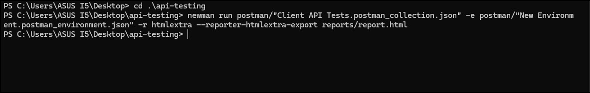
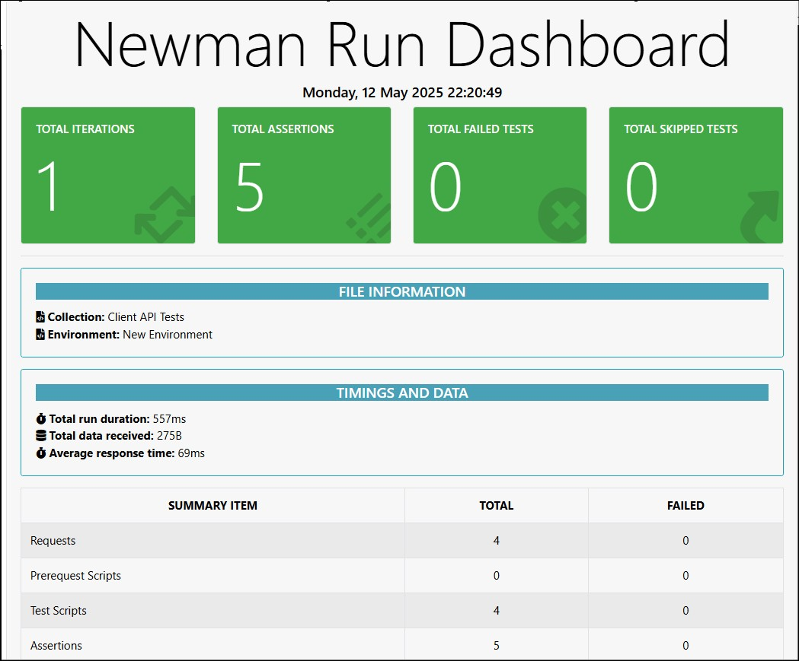
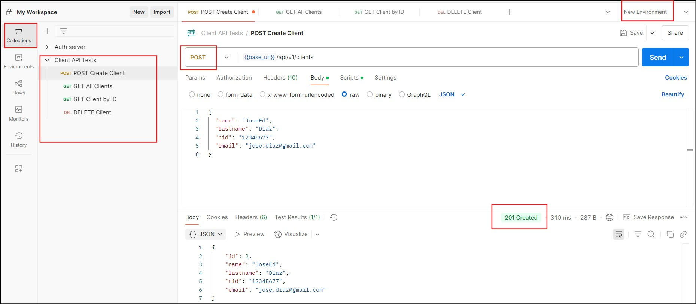

# 📦 API Testing Project — Client API

Este repositorio contiene un conjunto de pruebas automatizadas para la API REST de gestión de clientes utilizando **Postman** y **Newman**, con generación de reportes en formato HTML.

## 📑 Descripción

La API permite realizar operaciones CRUD sobre clientes. Se han creado diferentes peticiones para verificar el correcto funcionamiento de los endpoints disponibles, incluyendo pruebas de creación, listado, consulta por ID y eliminación de clientes.

## 🛠️ Tecnologías

- [Postman](https://www.postman.com/) — Colección de pruebas
- [Newman](https://github.com/postmanlabs/newman) — CLI para ejecución de colecciones
- [htmlextra](https://www.npmjs.com/package/newman-reporter-htmlextra) — Generación de reportes HTML detallados

## 📂 Estructura del Proyecto

```
api-testing/
├── data/                     
├── postman/
│   ├── Client API Tests.postman_collection.json    
│   ├── New Environment.postman_environment.json    
├── reports/
│   └── report.html            
├── screenshots/
│   └── run-newman.png         
└── README.md                  
```

## ▶️ Ejecución de Pruebas

### 📌 1️⃣ Instalación de dependencias

Asegúrate de tener **Node.js** y **Newman** instalados:

```bash
npm install -g newman
npm install -g newman-reporter-htmlextra
```

### 📌 2️⃣ Comando de ejecución

Desde la raíz del proyecto:

```bash
newman run postman/"Client API Tests.postman_collection.json" \
-e postman/"New Environment.postman_environment.json" \
-r htmlextra --reporter-htmlextra-export reports/report.html
```

## 📊 Evidencias de Ejecución

### ✅ Resultado en terminal:



## ✅ Reporte HTML Online

Puedes visualizar el reporte generado por **Newman** con el reporter **htmlextra** desde este enlace:

[🔍 Ver Reporte de Test API](https://josediazlopez88.github.io/api-testing/report.html)

---

### 📸 Vista previa del reporte

A continuación se muestra una captura de pantalla de una sección del reporte generado:




### ✅ Postman UI:


## 📋 Detalles de las Pruebas

| Nombre de Prueba    | Método | Endpoint                        | Validaciones                                  |
|:-------------------|:--------|:--------------------------------|:----------------------------------------------|
| POST Create Client  | POST   | `/api/v1/clients`               | Código 201, guardado de `clientId` en entorno |
| GET All Clients     | GET    | `/api/v1/clients`               | Código 200, respuesta JSON                    |
| GET Client by ID    | GET    | `/api/v1/clients/{{clientId}}`  | Código 200 o 404                              |
| DELETE Client       | DELETE | `/api/v1/clients/{{clientId}}`  | Código 204 o 404                              |

## 📌 Notas

- Las variables de entorno se manejan desde `New Environment.postman_environment.json`.
- El reporte detallado se genera automáticamente en `reports/report.html` tras cada ejecución.
- Se pueden agregar más pruebas o parametrizaciones utilizando archivos en `data/` si se requiere.

## 📈 Autor

**José E. Díaz López**  
📧 jose.dciaz@gmail.com  

## 📖 Licencia

Este proyecto está bajo licencia MIT — libre para uso y modificación.
